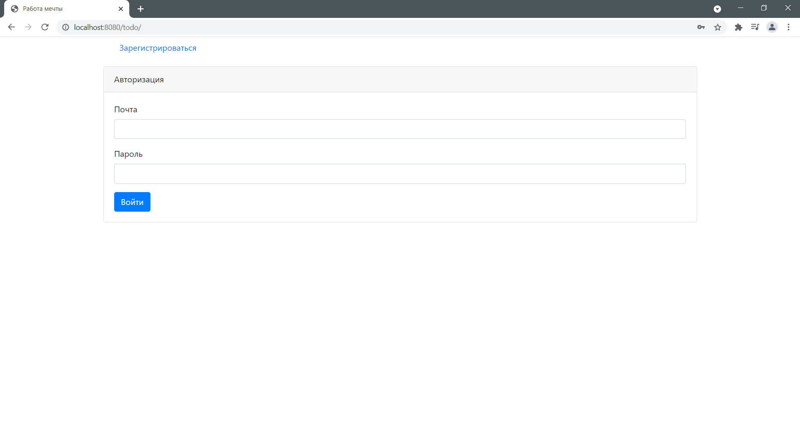
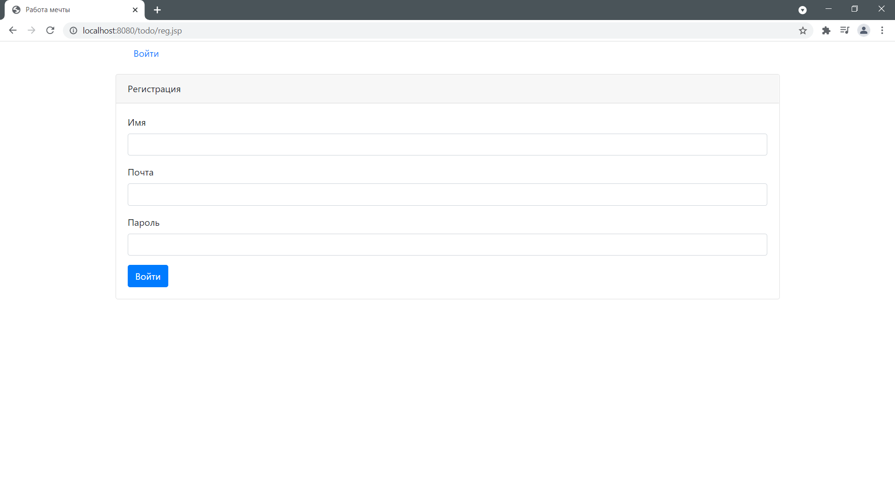
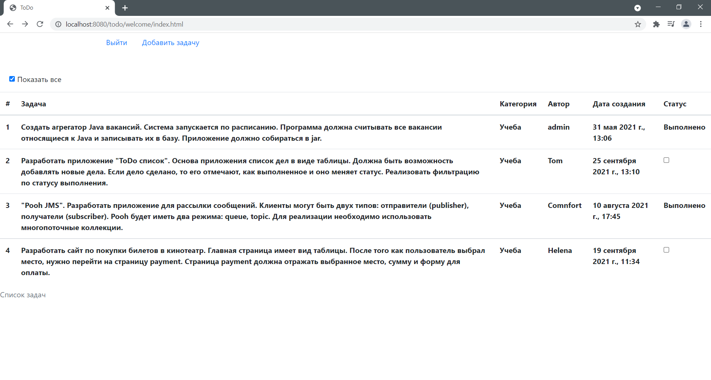

ToDo
=============

This project is to maintain current and completed tasks. Allows you to 
create new tasks on the selected topic and filter tasks by status.

#### Dependencies

* Java 14
* Servlets
* JSP(JSTL), HTML, JavaScript(JQuery, Ajax), Bootstrap
* Hibernate + PostgreSQL
* Junit, Hamcrest
* Maven
* Tomcat
* Log4j, Slf4j
* Travis CI
* Checkstyle

#### Demo

